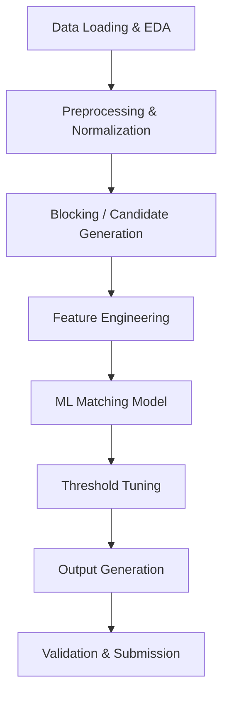

# ML Challenge 2026 — Business Entity Resolution: Complete Breakdown

---

## 1. What Is This Challenge?

This is an **Entity Resolution (ER)** challenge. You receive business records from **3 independent data sources** — each containing noisy, partial, and inconsistent information about the same real-world businesses. Your job is to build an ML pipeline that determines **which records across sources refer to the same real-world business**.

> [!IMPORTANT]
> **Source 1 is the "anchor" (reference) source.** For every Source 1 entity, you must find all matching records from Source 2 and Source 3. A Source 1 entity may match **zero, one, or many** S2/S3 records.

---

## 2. Data Description

### 2.1 Dataset Scale

| File | Records (approx.) | Size |
|---|---|---|
| `train_source1.tsv` | **2.2 million** | 200 MB |
| `train_source2.tsv` | **5.0 million** | 467 MB |
| `train_source3.tsv` | **5.3 million** | 480 MB |
| `train_ground_truth.tsv` | **2.2 million** rows | 121 MB |
| `test_source1.tsv` | **1.7 million** | 167 MB |
| `test_source2.tsv` | **4.9 million** | 486 MB |
| `test_source3.tsv` | **5.1 million** | 483 MB |

> [!CAUTION]
> This is a **massive-scale** ER problem. Naïve all-pairs comparison (S1 × S2 + S1 × S3) would produce **trillions** of pairs. **Blocking/candidate generation is critical.**

### 2.2 Columns (All Source Files)

Each source TSV has **4 columns**, tab-separated:

| Column | Description | Example |
|---|---|---|
| `entity_id` | Unique ID with source prefix (`S1-`, `S2-`, `S3-`) | `S1-925783039` |
| `business_name` | Business name (noisy) | `Orelee's Barbershop` |
| `business_address` | Address (noisy, partial, varied formats) | `1795 Westchester Drive, High Point, NC` |
| `country` | Country label | `US`, `India`, `France` (test only) |

### 2.3 Ground Truth Format

`train_ground_truth.tsv` has **2 columns**:

| Column | Description |
|---|---|
| `source1_entity_id` | An S1 entity ID |
| `matched_entity_ids` | Comma-separated list of matching S2/S3 IDs (empty if singleton) |

**Example rows:**
```
S1-965667     S2-681193310,S2-743505751,S3-775321672,S3-11291185,S3-860443364
S1-302869473  (empty — this is a singleton, no matches)
```

**Ground Truth Distribution:**

| Category | Count | Percentage |
|---|---|---|
| **Total S1 entities** | 2,206,821 | 100% |
| **With matches** (have S2/S3 links) | 2,083,574 | **94.4%** |
| **Singletons** (no matches) | 123,247 | **5.6%** |

> [!TIP]
> ~5.6% of entities are singletons. Since correctly predicting "no match" scores 1.0 per entity, and wrongly predicting matches for a singleton scores 0.0, correctly handling singletons alone contributes meaningfully to your macro-averaged F₀.₅. Don't ignore them!

### 2.4 Noise Patterns Observed in the Data

From inspecting the actual data, here are the noise patterns present:

#### Business Name Noise
| Pattern | Source 1 | Source 2/3 |
|---|---|---|
| **Word-order transpositions** | `Consulting Nyasa Nursing Private Limited` | words may be reordered |
| **Abbreviations** | `B+ Retail Inc` | `B+ Retail Incorporated` |
| **Legal suffix variations** | `Ltd` ↔ `Limited`, `Pvt` ↔ `Private`, `Corp` ↔ `Corporation` |
| **DBA / trade names** | extra "dba" names appended | `Ectolumdrex dba X+ Madison Inc` |
| **Punctuation differences** | `&` vs `and`, extra punctuation |
| **Typos / misspellings** | `Delta Tetlecommunication Inc` (typo for Telecommunication) |
| **URLs appended** | normal name | `SHIVSHAKTI VIDYALAYA ... \| www.shivshakti.com` |
| **Non-ASCII / encoding garbage** | clean name | Garbled Unicode characters (e.g., Hindi transliterations) |

#### Address Noise
| Pattern | Example |
|---|---|
| **Abbreviations** | `Rd` ↔ `Road`, `St` ↔ `Street`, `Ave` ↔ `Avenue` |
| **Component reordering** | `OH, Columbus, 5559 Orville Avenue` vs `5559 Orville Avenue, Columbus, OH` |
| **Missing components** | No PIN code, no state, no zip |
| **Landmark references (India)** | `Near Fortis Hospital`, `Near SBI ATM` |
| **Case differences** | `High Point, NC` vs `HIGH POINT, NC` |
| **State format** | `North Carolina` vs `NC` vs `N.C.` |

### 2.5 Countries

| Split | Countries |
|---|---|
| **Training** | `US`, `India` |
| **Test** | `US`, `India`, **`France`** (unseen in training!) |

> [!WARNING]
> **France does NOT appear in training data.** Your pipeline must handle it gracefully — do NOT hard-code country lists or use country-specific one-hot encoding. Treat country as an open-set string.

---

## 3. What You Must Produce

### 3.1 Primary Output: `matching_results.tsv`

Your final entity matches — **this is what gets scored**:

```
source1_entity_id	matched_entity_ids
S1-00001	S2-00047,S2-00193,S3-00812
S1-00002	S3-00004
S1-00003	
```

**Rules:**
- ✅ Every S1 entity in the test set must have exactly one row
- ✅ Leave `matched_entity_ids` empty for singletons (no matches)
- ✅ Only S2/S3 IDs from the test set
- ❌ No duplicate IDs within a list
- ❌ No S1 IDs in the match list

### 3.2 Secondary Output: `candidate_pairs.tsv`

Your blocking/candidate-generation output (not scored, but audited):

```
source1_entity_id	candidate_entity_ids
S1-00001	S2-00047,S2-00193,S3-00812,S3-00999
S1-00002	S3-00004
S1-00003	
```

Final matches should be a **subset** of candidates.

### 3.3 Evaluation Metric

**F₀.₅ Score (macro-averaged per S1 entity)**

$$F_{0.5} = \frac{1.25 \times \text{Precision} \times \text{Recall}}{0.25 \times \text{Precision} + \text{Recall}}$$

- **Precision-heavy** (2× weight on precision vs recall)
- False merges (merging two different businesses) hurt more than missed matches
- Singletons correctly predicted as empty → score 1.0 for that entity
- Singletons incorrectly given matches → score 0.0

---

## 4. Implementation Roadmap

Here is the complete pipeline you need to build:



### Phase 1: Data Loading & EDA

```python
import pandas as pd

# CRITICAL: use sep="\t" for TSV files!
s1 = pd.read_csv("dataset/train/train_source1.tsv", sep="\t")
s2 = pd.read_csv("dataset/train/train_source2.tsv", sep="\t")
s3 = pd.read_csv("dataset/train/train_source3.tsv", sep="\t")
gt = pd.read_csv("dataset/train/train_ground_truth.tsv", sep="\t")
```

**EDA tasks:**
- Distribution of matches per S1 entity (0, 1, 2, 3+)
- Country distribution across sources
- Missing values per column
- Business name length distributions
- Address completeness analysis
- Proportion of singletons

### Phase 2: Preprocessing & Normalization

- **Lowercase** everything
- **Normalize legal suffixes**: `ltd` → `limited`, `pvt` → `private`, `corp` → `corporation`, `inc` → `incorporated`, `llc` → unchanged
- **Remove punctuation**: periods, commas (but keep `&`/`and` distinction)
- **Strip URLs** from business names
- **Normalize address abbreviations**: `rd` → `road`, `st` → `street`, `ave` → `avenue`, `blvd` → `boulevard`
- **Extract structured components** from addresses: street number, street name, city, state/province, postal code
- **Remove non-ASCII garbage** (garbled transliterations)
- **Phonetic encoding** for names: Soundex, Metaphone, or NYSIIS

### Phase 3: Blocking / Candidate Generation

> [!IMPORTANT]
> This is the **most critical phase** — it determines your recall ceiling. If a true match isn't in your candidate set, your model can never find it.

**Blocking strategies to combine (multi-pass blocking):**

| Strategy | Key | Why |
|---|---|---|
| **Country blocking** | `country` | Never compare US vs India entities |
| **Name token blocking** | Top-k TF-IDF tokens from `business_name` | Groups entities sharing rare name words |
| **N-gram blocking** | Character 3-grams of name | Catches typos and abbreviations |
| **Phonetic blocking** | Soundex/Metaphone of first word of name | Catches phonetic variations |
| **Address token blocking** | City name, postal code, street number | Location-based grouping |
| **Sorted Neighbourhood** | Sorted by phonetic name, compare within window | Catches close variations |

**Key metrics:**
- **Recall ceiling**: % of true matches in your candidate set (aim for >95%)
- **Reduction ratio**: ratio of candidates to all-pairs (aim for >99.9% reduction)

### Phase 4: Feature Engineering

For each (S1, S2/S3) candidate pair, compute similarity features:

#### Name Features
- **Jaccard similarity** on name tokens
- **Levenshtein / edit distance** (normalized)
- **Jaro-Winkler similarity**
- **TF-IDF cosine similarity** on name
- **Token sort ratio** (fuzzy matching)
- **Common prefix length**
- **Phonetic match** (Soundex/Metaphone equality)

#### Address Features
- **Jaccard similarity** on address tokens
- **Levenshtein distance** on full address
- **TF-IDF cosine** on address
- **Exact postal code match** (when available)
- **City name similarity**
- **Street number match**

#### Cross Features
- **Country exact match** (should always be true after blocking)
- **Combined name+address similarity** (e.g., weighted average)
- **Length ratio** of names
- **Token overlap ratio** for name and address combined

### Phase 5: ML Matching Model

**Recommended models** (must be MIT/Apache 2.0 license, ≤8B parameters):

| Model | When to Use |
|---|---|
| **XGBoost / LightGBM** | Strong baseline, fast, handles tabular features well |
| **Random Forest** | Good interpretability |
| **Sentence-Transformers (small)** | For embedding-based matching (e.g., `all-MiniLM-L6-v2`) |
| **Fine-tuned BERT-small** | For learning name/address similarity |

**Training approach:**
1. Use ground truth to create positive pairs (S1 → matched S2/S3)
2. Sample negative pairs from blocking candidates that are NOT matches
3. Handle class imbalance (many more non-matches than matches)
4. Train binary classifier: match vs. no-match

### Phase 6: Threshold Tuning

- Optimize the classification threshold for **F₀.₅** on a validation split
- Since F₀.₅ is precision-heavy, **raise the threshold** higher than the default 0.5
- Typical optimal thresholds are in the 0.6–0.8 range
- Grid search thresholds on validation set

### Phase 7: Output Generation

```python
# Generate matching_results.tsv
results = []
for s1_id in test_source1.entity_id:
    matched = model.predict_matches(s1_id)  # list of S2/S3 IDs
    results.append({
        'source1_entity_id': s1_id,
        'matched_entity_ids': ','.join(matched) if matched else ''
    })

df_results = pd.DataFrame(results)
df_results.to_csv('output/matching_results.tsv', sep='\t', index=False)

# Generate candidate_pairs.tsv similarly from blocking output
```

### Phase 8: Validation

```bash
python utils/validate_submission.py \
    --matching output/matching_results.tsv \
    --candidate output/candidate_pairs.tsv \
    --test-dir dataset/test
```

---

## 5. Key Constraints & Rules

| Constraint | Detail |
|---|---|
| **Model license** | MIT or Apache 2.0 only |
| **Model size** | ≤ 8 billion parameters |
| **No external data** | No APIs, no geocoding, no business lookup databases |
| **No external ER services** | No commercial entity resolution tools |
| **File format** | Tab-separated `.tsv` |
| **Encoding** | UTF-8 |

---

## 6. Tips for Maximizing Score

1. **Blocking recall is your ceiling** — invest heavily in multi-strategy blocking
2. **Precision > Recall** — F₀.₅ punishes false merges 2× more than missed matches
3. **Singletons matter** — correctly predicting "no match" earns 1.0 per entity
4. **Handle France** — your pipeline must work on unseen countries
5. **Use validation splits** — hold out from training to estimate F₀.₅ locally
6. **Address the encoding noise** — Indian entries often have garbled Unicode; strip non-printable characters
7. **Scale matters** — your blocking must be efficient at millions of records

---

## 7. Final Submission Package Structure

```
<team_name>_submission.zip
├── output/
│   ├── matching_results.tsv       # scored on leaderboard
│   └── candidate_pairs.tsv        # audited for pipeline quality
├── code/
│   └── business_entity_resolution/
│       ├── src/                   # all source code
│       ├── README.md              # reproduction instructions
│       └── requirements.txt       # pinned dependencies
└── Documentation_template.md      # methodology write-up
```
